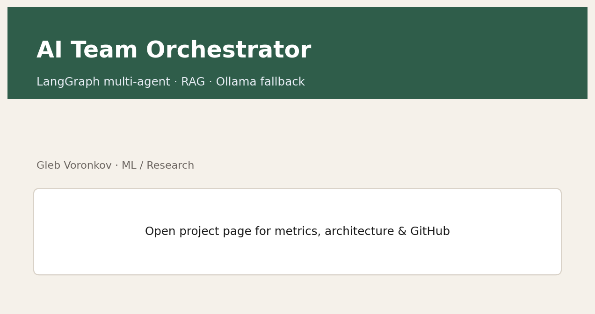
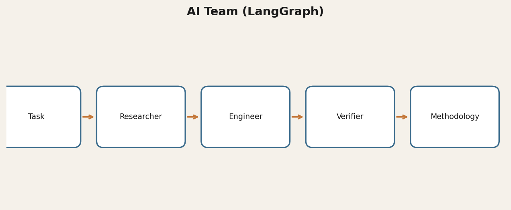
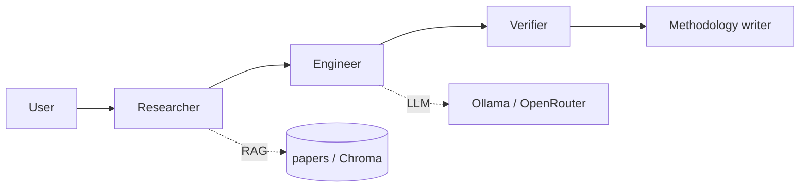

# AI Team Orchestrator

Multi-agent **LangGraph** workflow: researcher → engineer → verifier → methodology writer, with optional **RAG** and Ollama fallback.

[](https://www.python.org/)
[](LICENSE)
[](https://glebvoronkov03.github.io/gleb-web-portfolio/projects/ai-team.html)

> Author: Gleb Voronkov · Apache-2.0

## Demo



## Why it matters
Multi-step research and coding tasks need clear roles, retrieval, and verification — not a single unbounded chat turn.

## Architecture





## Quickstart
```powershell
python -m venv .venv
# Windows: .\.venv\Scripts\Activate.ps1  |  Linux/macOS: source .venv/bin/activate
pip install openai langgraph chromadb sentence-transformers fastapi uvicorn python-dotenv requests pypdf
copy .env.example .env   # or: cp .env.example .env
# edit .env with your key OR rely on local Ollama
python run_team.py
# or: python web_app.py
```

Put open abstracts / your own public papers into `papers/` and run `ingest_knowledge.py`.

## Results
- FastAPI UI + optional Telegram bot
- Prompt IP anonymization helper for safer external LLM calls
- Local Ollama fallback (`qwen2.5-coder`) when cloud keys are unavailable

## License & citation
Apache-2.0 · `mybook3@mail.ru` · `@Gleb_Voronkov`

## Links
- Portfolio: [https://glebvoronkov03.github.io/gleb-web-portfolio/projects/ai-team.html](https://glebvoronkov03.github.io/gleb-web-portfolio/projects/ai-team.html)
- Related: [pscore-rag-assistant](https://github.com/GlebVoronkov03/pscore-rag-assistant)
